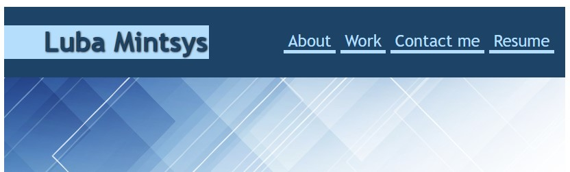
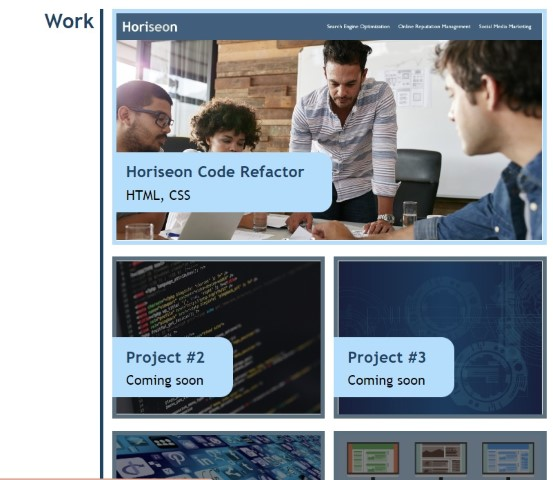

# portfolio
## Description
The aim of this project was to create a portfolio which would showcase my work and provide my contact information to a potential hiring manager. The portfolio includes a short paragraph about myself, links to my previous deployed projects and to my resume, contact info, and a navigation menu for an easier access.
Working on this project, provided me with a valuable knowledge on building and organizing a webpage with HTML and styling the HTML elements using CSS. 
## Installation

n/a

## Usage
A user can navigate through the protfolio using the navigation menu at the top right corner. By clicking on each of the projects' photos, they will be taken to a deployed webpage of each project. At the moment, only one project is available - the Horiseon Code Reafactor. When clicking on the Resume from the navigation menu, the pdf file will open in a new window. 

## Credits

Luba Mintsys. https://github.com/lmintsys
Hero image credits - <a href="https://www.freepik.com/free-vector/modern-banner-with-abstract-low-poly-design_16078483.htm#query=abstract%20background&position=17&from_view=keyword">Image by kjpargeter</a> on Freepik

## License

MIT License

Copyright (c) 2022 lmintsys

Permission is hereby granted, free of charge, to any person obtaining a copy
of this software and associated documentation files (the "Software"), to deal
in the Software without restriction, including without limitation the rights
to use, copy, modify, merge, publish, distribute, sublicense, and/or sell
copies of the Software, and to permit persons to whom the Software is
furnished to do so, subject to the following conditions:

The above copyright notice and this permission notice shall be included in all
copies or substantial portions of the Software.

THE SOFTWARE IS PROVIDED "AS IS", WITHOUT WARRANTY OF ANY KIND, EXPRESS OR
IMPLIED, INCLUDING BUT NOT LIMITED TO THE WARRANTIES OF MERCHANTABILITY,
FITNESS FOR A PARTICULAR PURPOSE AND NONINFRINGEMENT. IN NO EVENT SHALL THE
AUTHORS OR COPYRIGHT HOLDERS BE LIABLE FOR ANY CLAIM, DAMAGES OR OTHER
LIABILITY, WHETHER IN AN ACTION OF CONTRACT, TORT OR OTHERWISE, ARISING FROM,
OUT OF OR IN CONNECTION WITH THE SOFTWARE OR THE USE OR OTHER DEALINGS IN THE
SOFTWARE.